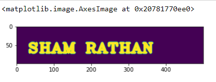

# Opening-and-Closing

## Aim
To implement Opening and Closing using Python and OpenCV.

## Software Required
1. Anaconda - Python 3.7
2. OpenCV
## Algorithm:
### Step1:
Import the necessary packages
### Step2:
Create the Text using cv2.putText
### Step3:
Create the structuring element
### Step4:
Use Opening operation
### Step5:
Use Closing Operation
## Program:
```
Developed by: Sham Rathan.S
Register num: 212221230093
# Import the necessary packages
import numpy as np
import cv2
import matplotlib.pyplot as plt

# Create the Text using cv2.putText
img1=np.zeros((100,500),dtype='uint8')
font=cv2.FONT_HERSHEY_COMPLEX_SMALL
im=cv2.putText(img1,' SHAM RATHAN ',(5,70),font,2,(255),5,cv2.LINE_AA)
plt.imshow(im)

# Create the structuring element
Kernel=cv2.getStructuringElement(cv2.MORPH_CROSS,(11,11))

# Use Opening operation
image1=cv2.morphologyEx(im,cv2.MORPH_OPEN,Kernel)
plt.imshow(image1)

# Use Closing Operation
image1=cv2.morphologyEx(im,cv2.MORPH_CLOSE,Kernel)
plt.imshow(image1)

```
## Output:
### Display the input Image

### Display the result of Opening

### Display the result of Closing


## Result
Thus the Opening and Closing operation is used in the image using python and OpenCV.
